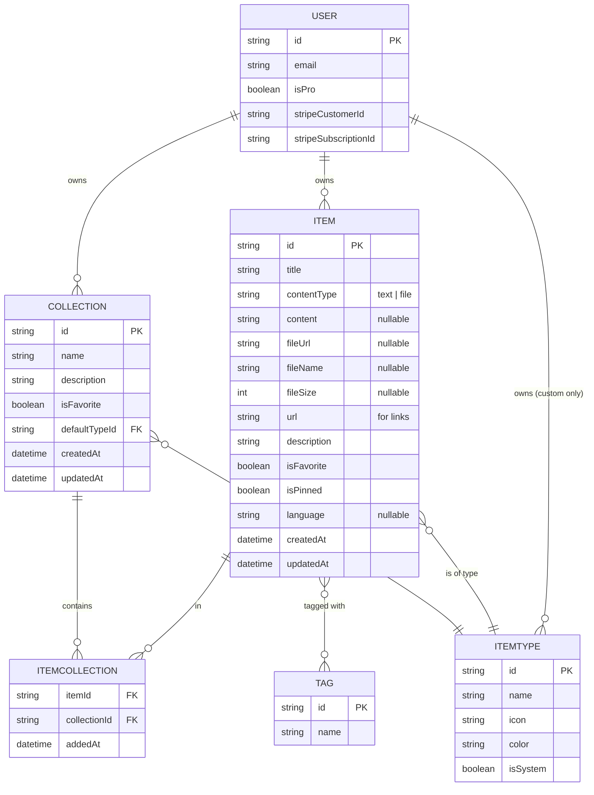

# 📦 DevStash — Project Overview

> One fast, searchable, AI-enhanced hub for all developer knowledge & resources.

---

## 🎯 Problem

Developers keep their essentials scattered across too many tools:

- 🧩 Code snippets in VS Code or Notion
- 🤖 AI prompts in chat histories
- 📁 Context files buried in projects
- 🔗 Useful links in browser bookmarks
- 📚 Docs in random folders
- ⌨️ Commands in `.txt` files or bash history
- 🧱 Project templates scattered across GitHub gists

This creates **context switching**, **lost knowledge**, and **inconsistent workflows**.

**DevStash solves this** by providing a single, fast, searchable, AI-enhanced hub for everything a developer needs at their fingertips.

---

## 👥 Target Users

| Persona                        | What They Stash                               |
| ------------------------------ | --------------------------------------------- |
| **Everyday Developer**         | Snippets, prompts, commands, links            |
| **AI-First Developer**         | Prompts, contexts, workflows, system messages |
| **Content Creator / Educator** | Code blocks, explanations, course notes       |
| **Full-Stack Builder**         | Patterns, boilerplates, API examples          |

---

## ✨ Features

### A. Items & Item Types

Items are the core unit of DevStash. Each item has a **type** that determines how it's stored, displayed, and interacted with.

**System types** (cannot be edited or deleted):

| Type    | Icon         | Color                | Content Kind | Plan    |
| ------- | ------------ | -------------------- | ------------ | ------- |
| Snippet | `Code`       | `#3b82f6` 🔵 Blue    | text         | Free    |
| Prompt  | `Sparkles`   | `#8b5cf6` 🟣 Purple  | text         | Free    |
| Command | `Terminal`   | `#f97316` 🟠 Orange  | text         | Free    |
| Note    | `StickyNote` | `#fde047` 🟡 Yellow  | text         | Free    |
| Link    | `Link`       | `#10b981` 🟢 Emerald | url          | Free    |
| File    | `File`       | `#6b7280` ⚫ Gray    | file         | **Pro** |
| Image   | `Image`      | `#ec4899` 🌸 Pink    | file         | **Pro** |

**Custom types** — coming later as a Pro feature.

**Routing convention:** items are listed at `/items/{type}` (e.g. `/items/snippets`, `/items/prompts`).

**UX:** items are quick to create and access via a slide-in drawer rather than a full page navigation.

### B. Collections

Collections group related items. Key rules:

- A collection can hold items of **any type**
- An item can belong to **multiple collections** (many-to-many via join table)
- Each collection can have a `defaultTypeId` so new items added to an empty collection start with the right type

**Examples:**

- _"React Patterns"_ — mostly snippets + notes
- _"Context Files"_ — files
- _"Python Snippets"_ — snippets
- _"Interview Prep"_ — snippets, notes, links

### C. Search

Powerful, fast search across:

- Content body
- Tags
- Titles
- Item types

### D. Authentication

Powered by **NextAuth v5**:

- Email + password
- GitHub OAuth

### E. Quality-of-Life Features

- ⭐ Favorites (items and collections)
- 📌 Pin items to top
- 🕒 Recently used
- 📥 Import code from a file
- ✍️ Markdown editor for text-based types
- 📤 File upload for `file` / `image` types
- 📦 Export data in multiple formats
- 🌙 Dark mode (default) + ☀️ Light mode
- ➕ Add/remove items to/from multiple collections
- 👁️ View which collections an item belongs to

### F. AI Features (Pro only)

- 🏷️ AI auto-tag suggestions
- 📝 AI summaries
- 💡 AI "Explain this code"
- 🎯 Prompt optimizer

---

## 🗄️ Data Model

### Entity Relationship Diagram



### Prisma Schema (Draft)

> ⚠️ This is a **starting draft**, not final. Adjust as the build evolves.

```prisma
// schema.prisma

generator client {
  provider = "prisma-client-js"
}

datasource db {
  provider = "postgresql"
  url      = env("DATABASE_URL")
}

// --- Auth (extends NextAuth defaults) ---

model User {
  id                   String   @id @default(cuid())
  name                 String?
  email                String   @unique
  emailVerified        DateTime?
  image                String?

  // Subscription
  isPro                Boolean  @default(false)
  stripeCustomerId     String?  @unique
  stripeSubscriptionId String?  @unique

  // Relations
  accounts             Account[]
  sessions             Session[]
  items                Item[]
  collections          Collection[]
  customTypes          ItemType[]

  createdAt            DateTime @default(now())
  updatedAt            DateTime @updatedAt
}

// NextAuth models (Account, Session, VerificationToken) omitted for brevity

// --- Core domain ---

model Item {
  id          String   @id @default(cuid())
  title       String
  description String?

  // Content storage
  contentType String   // "text" | "file"
  content     String?  @db.Text   // text body OR null when file
  fileUrl     String?                // R2 URL OR null when text
  fileName    String?
  fileSize    Int?                   // bytes
  url         String?                // for link types

  // Code metadata
  language    String?

  // Flags
  isFavorite  Boolean  @default(false)
  isPinned    Boolean  @default(false)

  // Relations
  userId      String
  user        User     @relation(fields: [userId], references: [id], onDelete: Cascade)
  itemTypeId  String
  itemType    ItemType @relation(fields: [itemTypeId], references: [id])
  collections ItemCollection[]
  tags        Tag[]    @relation("ItemTags")

  createdAt   DateTime @default(now())
  updatedAt   DateTime @updatedAt

  @@index([userId])
  @@index([itemTypeId])
}

model ItemType {
  id          String   @id @default(cuid())
  name        String
  icon        String   // lucide icon name, e.g. "Code"
  color       String   // hex, e.g. "#3b82f6"
  isSystem    Boolean  @default(false)

  // null for system types; set for user-owned custom types
  userId      String?
  user        User?    @relation(fields: [userId], references: [id], onDelete: Cascade)

  items       Item[]
  collections Collection[] @relation("CollectionDefaultType")

  @@unique([userId, name])
}

model Collection {
  id            String   @id @default(cuid())
  name          String
  description   String?
  isFavorite    Boolean  @default(false)

  defaultTypeId String?
  defaultType   ItemType? @relation("CollectionDefaultType", fields: [defaultTypeId], references: [id])

  userId        String
  user          User     @relation(fields: [userId], references: [id], onDelete: Cascade)

  items         ItemCollection[]

  createdAt     DateTime @default(now())
  updatedAt     DateTime @updatedAt

  @@index([userId])
}

model ItemCollection {
  itemId       String
  collectionId String
  addedAt      DateTime @default(now())

  item         Item       @relation(fields: [itemId], references: [id], onDelete: Cascade)
  collection   Collection @relation(fields: [collectionId], references: [id], onDelete: Cascade)

  @@id([itemId, collectionId])
  @@index([collectionId])
}

model Tag {
  id    String @id @default(cuid())
  name  String @unique
  items Item[] @relation("ItemTags")
}
```

> 🚨 **Migration policy:** **Never** use `prisma db push` or hand-edit the database. Every schema change goes through `prisma migrate` — first in dev, then in prod.

---

## 🛠️ Tech Stack

### Framework

- **Next.js 16** + **React 19**
- SSR pages with dynamic components
- API routes for backend (items, file uploads, AI calls)
- Single repo/codebase
- **TypeScript** for type safety

### Database & ORM

- **Neon PostgreSQL** (cloud)
- **Prisma 7** (latest — fetch the latest docs before scaffolding)
- **Redis** for caching _(maybe — evaluate when needed)_

### File Storage

- **Cloudflare R2** for file & image uploads

### Authentication

- **NextAuth v5**
- Email + password
- GitHub OAuth

### AI

- **OpenAI** — `gpt-5-nano` model

### UI

- **Tailwind CSS v4**
- **shadcn/ui** components

### Useful links

- [Next.js docs](https://nextjs.org/docs)
- [Prisma docs](https://www.prisma.io/docs)
- [Neon docs](https://neon.tech/docs)
- [NextAuth v5 docs](https://authjs.dev)
- [Cloudflare R2 docs](https://developers.cloudflare.com/r2/)
- [Tailwind CSS v4 docs](https://tailwindcss.com/docs)
- [shadcn/ui](https://ui.shadcn.com)
- [Lucide icons](https://lucide.dev)

---

## 💰 Monetization — Freemium

|                      | **Free**                | **Pro — $8/mo or $72/yr** |
| -------------------- | ----------------------- | ------------------------- |
| Items                | 50 total                | Unlimited                 |
| Collections          | 3                       | Unlimited                 |
| System types         | All _except_ file/image | All                       |
| File & image uploads | ❌                      | ✅                        |
| Custom types         | ❌                      | ✅ _(later)_              |
| Basic search         | ✅                      | ✅                        |
| AI auto-tagging      | ❌                      | ✅                        |
| AI code explanation  | ❌                      | ✅                        |
| AI prompt optimizer  | ❌                      | ✅                        |
| Export (JSON / ZIP)  | ❌                      | ✅                        |
| Priority support     | ❌                      | ✅                        |

> 🧪 **During development:** wire up the Pro plumbing (Stripe fields, `isPro` flag, gating helpers) but treat every user as Pro so the full feature surface is testable.

---

## 🎨 UI / UX Guidelines

### Design Principles

- **Modern & minimal** - developer-focused
- **Dark mode default** - light mode optional
- **Clean Typography** - generous whitespace
- **Subtle Accents** - borders and shadows sparingly
- **Syntax highlighting** - for code blocks

### Design References

- Notion
- Linear
- Raycast

### Screenshots

Refer to the screenshots below as a base for the dashboard UI. It does not have to be exact. Use it as a reference:

- @context/screenshots/dashboard-ui-main.png
- @context/screenshots/dashboard-ui-drawer.png

### Layout

```
┌─────────────────────────────────────────────────────────────┐
│  Sidebar (collapsible)    │  Main content                   │
│                           │                                 │
│  • Snippets               │  ┌──────────┐ ┌──────────┐      │
│  • Prompts                │  │Collection│ │Collection│ ...  │
│  • Commands               │  │  card    │ │  card    │      │
│  • Notes                  │  └──────────┘ └──────────┘      │
│  • Links                  │                                 │
│  • Files (Pro)            │  Items grid (color-coded        │
│  • Images (Pro)           │  border by type)                │
│                           │  ┌────┐ ┌────┐ ┌────┐ ┌────┐    │
│  ── Recent Collections ── │  │item│ │item│ │item│ │item│    │
│  • React Patterns         │  └────┘ └────┘ └────┘ └────┘    │
│  • Context Files          │                                 │
│  • Python Snippets        │  [ Item drawer slides in →   ]  │
└─────────────────────────────────────────────────────────────┘
```

- **Sidebar:** item types (links to `/items/{type}`) + latest collections
- **Main area:** grid of collection cards (background color = dominant item type), items appear beneath in cards with border color matching their type
- **Item interaction:** opens in a quick-access drawer (not a full page nav)

### Responsive

- Desktop-first, fully usable on mobile
- Sidebar collapses to a drawer on mobile

### Micro-interactions

- Smooth transitions
- Hover states on cards
- Toast notifications for actions
- Loading skeletons

---

## ✅ Build Checklist (suggested order)

1. **Foundation** — Next.js 16 app, TS, Tailwind v4, shadcn/ui, dark mode shell
2. **Auth** — NextAuth v5 with email/password + GitHub
3. **DB** — Neon + Prisma, initial migration, seed system `ItemType`s
4. **Items CRUD** — text types first (snippet/prompt/command/note/link), drawer UX
5. **Collections** — CRUD + many-to-many wiring via `ItemCollection`
6. **Search** — across content / tags / titles / types
7. **File storage** — Cloudflare R2 for `file` / `image` types
8. **Stripe** — Pro plumbing (gated off during dev)
9. **AI features** — OpenAI `gpt-5-nano` for tagging / explain / prompt optimizer
10. **Export** — JSON / ZIP
11. **Polish** — skeletons, toasts, micro-interactions, mobile pass
